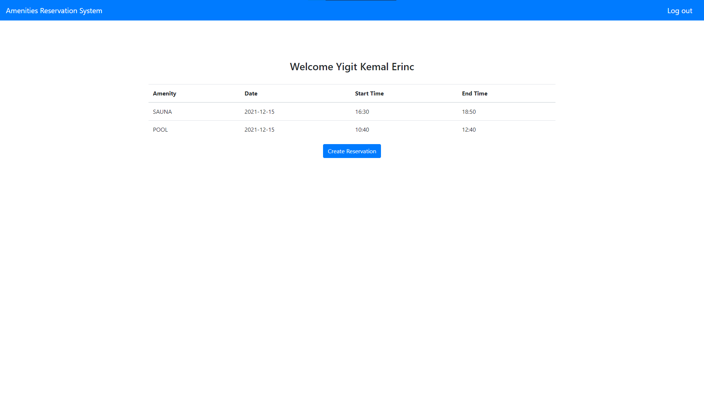
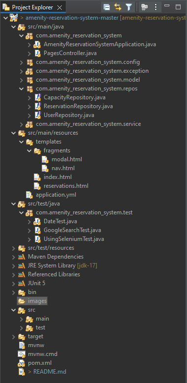
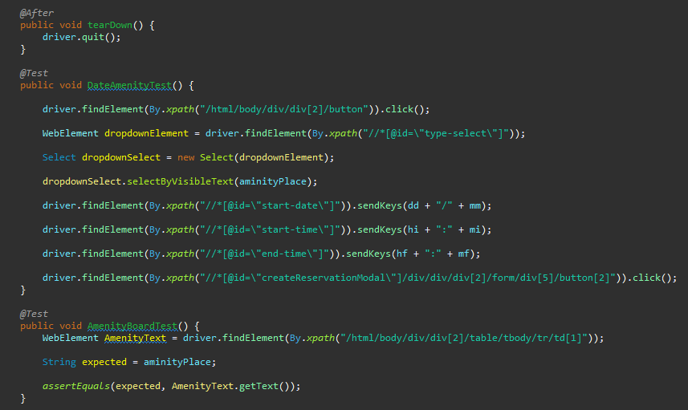
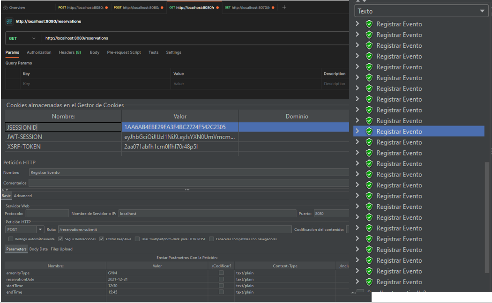
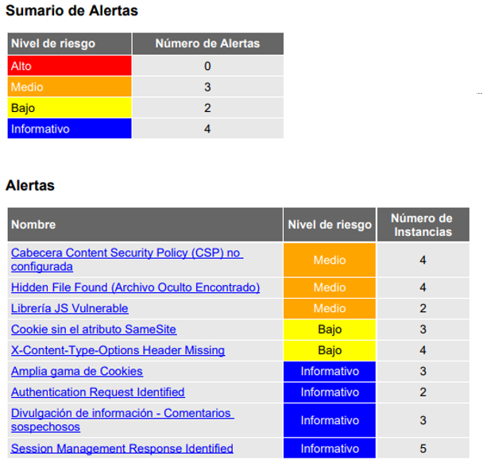
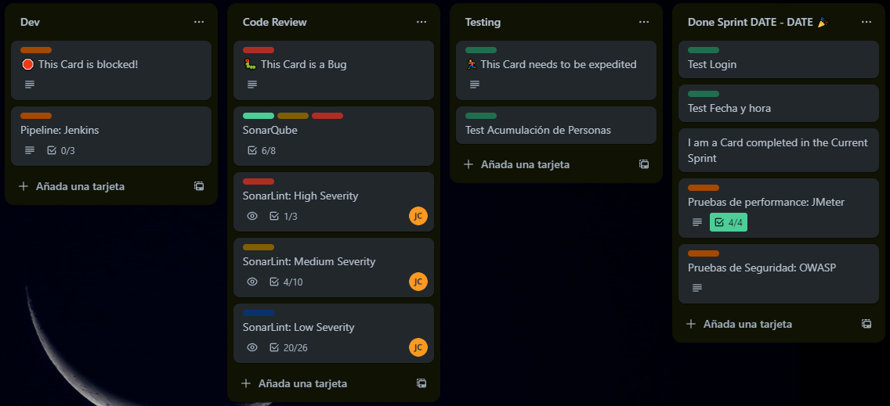

# Amenity Reservation System

Un sistema de reserva de servicios donde los usuarios/residentes pueden iniciar sesión y reservar un tiempo para utilizar un servicio como un gimnasio, 
una piscina o una sauna en un hipotético complejo de apartamentos. Cada amenidad tendrá una capacidad determinada (número de personas que pueden utilizar 
el servicio al mismo tiempo) para que las personas puedan hacer uso de las amenidades de manera segura durante la pandemia de Covid-19.

## Tecnologías
* Spring Boot
* Thymeleaf
* Hibernate
* Swagger
* Spring Security
* Bootify
* Maven
* JPA
* H2 In-Memory Database
* Bootstrap

## Casos de uso / Historias de usuarios

* Los usuarios deberían poder iniciar sesión.
* Asumiremos que las cuentas de los residentes están creadas previamente y no habrá ninguna función de registro.
* Los usuarios deberían poder ver sus reservas.
* Los usuarios deberían poder crear nuevas reservas seleccionando el tipo de servicio, la fecha y la hora.
* Solo los usuarios que hayan iniciado sesión deberían poder ver la página de reservas y crear reservas.
* Debemos verificar la capacidad y solo crear nuevas reservas si el número actual de reservas no excede la capacidad.

## Construcción Automática: Usar herramientas (por ejemplo maven o graddle para Java)

## Análisis Estático de Código Fuente: Usar herramientas SonarQube [Primer Análisis]

## Pruebas Unitarias: Usar frameworks xUnit (por ejemplo JUnit para Java)

## Pruebas Funcionales: Usar framework Selenium (o Appium)

## Pruebas de Performance: Usar herramienta JMeter

## Pruebas de Seguridad: Usar herramienta OWASP ZAP

## Gestión de Issues: Usar Github Issues, Trello o Jira

